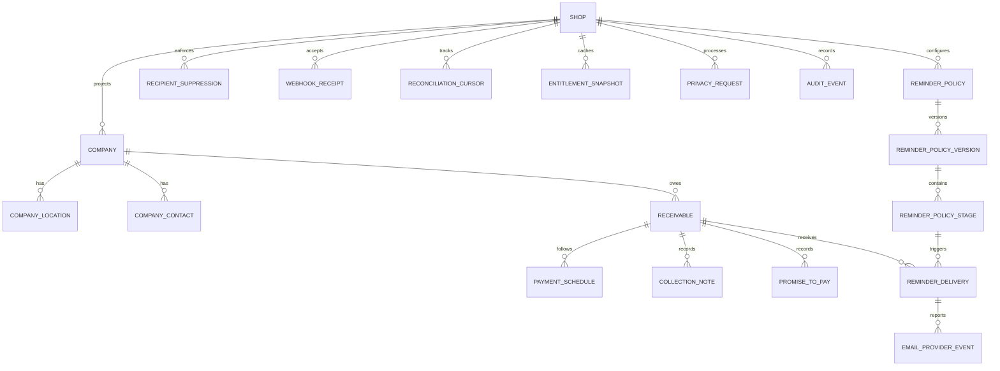

# Logical Data Model

**Status:** Approved
**Date:** 2026-07-14
**Approved:** 2026-07-15

## 1. Modeling rules

- PostgreSQL is the transactional store; Prisma is the initial data-access and
  migration layer.
- Internal primary keys use UUIDv7 (or an equivalent time-sortable UUID).
- Shopify GIDs are stored as text and are unique only inside a shop.
- Every tenant-owned table contains `shop_id`; foreign and unique constraints
  include it where practical to make cross-tenant references structurally hard.
- Money is `numeric(20,4)` plus ISO currency. Never use floating point and
  never add unlike currencies.
- Timestamps are UTC `timestamptz`. Policy scheduling also records the merchant
  IANA timezone and the resolved instant.
- Mutable records have `created_at`, `updated_at` and an optimistic `version`.
- Sensitive text and email are application-encrypted. Exact email matching uses
  a keyed HMAC, not a plaintext index.
- Shopify projections record `shopify_updated_at`, `last_observed_at`, source
  API version and reconciliation status.

## 2. Relationship overview

The Mermaid diagram is conceptual. All child relations also include
`shop_id`, even where Mermaid shows only the domain relationship.

## 3. Tenant and access records

### `shops`

`id`, `shopify_shop_gid`, normalized `shop_domain`, status, IANA timezone,
installed/uninstalled timestamps, global-reminders-paused flag, sync status,
last reconciled time, settings version and timestamps.

Unique: `shopify_shop_gid`; `shop_domain`.

### `shopify_sessions`

`shop_id`, mode (`OFFLINE` initially), encrypted access token, encrypted refresh
token, access expiry, refresh expiry, granted-scope fingerprint, token version,
rotated time and revoked time.

Only the Shopify adapter may decrypt these fields. A shop has one active
expiring offline-token lineage.

### `shop_members`

Optional cached actor identity for audit display: `shop_id`, Shopify user ID,
role/category and last seen. Do not persist name or email for MVP. Authorization
still comes from the current verified Shopify session, not this cache.

## 4. Shopify projection

### `companies`

`shop_id`, Shopify company GID, company display name, status/tombstone,
`shopify_updated_at`, observation and reconciliation metadata.

Company name is protected Level-1 data and must follow shop/customer redaction.

### `company_locations`

`shop_id`, `company_id`, Shopify location GID, safe display label, status and
source metadata. Billing/shipping addresses are not stored.

### `company_contacts`

`shop_id`, `company_id`, optional `company_location_id`, Shopify company-contact
GID, Shopify customer GID, encrypted default email, email HMAC, email validity,
recipient role/default flags, redacted time and source metadata.

Do not store contact name, address, phone, marketing profile or unrelated
customer fields.

### `receivables`

One record per in-scope Shopify order: `shop_id`, Shopify order GID, order name,
company/location relation, status (`OPEN`, `PAID`, `CANCELED`, `REFUNDED`,
`CLOSED`), original total, outstanding amount, currency, issued time, effective
due time, days overdue, aging bucket, payment-terms type, authoritative payment
facts, projection version and source metadata.

Unique: `(shop_id, shopify_order_gid)`.

`days_overdue` and aging bucket are reproducible cache values. The source
amounts and dates—not the cached bucket—are the audit basis.

### `payment_schedules`

`shop_id`, `receivable_id`, Shopify schedule GID, balance due, total balance,
currency, due flag, issued/due/completed times and source metadata.

Use Shopify `balanceDue` and `totalBalance`; do not use deprecated `amount`.

### `receivable_state_transitions`

Append-only facts explaining material projection changes: previous/current
status and balance, reason, Shopify/webhook correlation, source time and
recorded time. These support audit and reliability calculations but are not a
replacement financial ledger.

## 5. Collections records

### `collection_notes`

`shop_id`, company/receivable, type (`INTERNAL`, `EXTERNAL_PAYMENT`, `DISPUTE`,
`SNOOZE_REASON`), encrypted body, actor ID, optional effective time and
timestamps. External-payment notes are always non-authoritative.

### `promises_to_pay`

`shop_id`, company/receivable, promised date, optional amount/currency,
encrypted note, status, creator, fulfilled/broken/canceled/superseded times and
superseding promise ID. State changes are append-audited.

### `collection_actions`

Append-only normalized timeline: note, promise, snooze, dismissal, manual send,
policy send, statement or suppression. It contains internal references and
safe summaries, not duplicated sensitive bodies.

The daily queue is computed from receivables, promises, policy state and recent
actions. Do not persist a second authoritative queue unless performance data
later justifies a refreshable projection.

### `reliability_snapshots`

Explainable aggregate facts per company: eligible invoice count, paid-late
count, median/average days late, broken-promise count, calculation window,
calculated time and algorithm version. No opaque score or protected attributes.

## 6. Reminder and statement records

### `reminder_policies`

`shop_id`, name, active version, state (`DRAFT`, `APPROVED`, `ACTIVE`, `PAUSED`,
`ARCHIVED`), merchant timezone, approved-by actor/time and timestamps.

### `reminder_policy_versions`

Immutable snapshot of sender display name, verified reply-to, eligibility rules,
template configuration and version. Editing creates a draft version; activation
requires preview and explicit approval.

### `reminder_policy_stages`

`shop_id`, version, stable stage key, offset relative to due date, ordering,
subject template, encrypted body template, enabled flag and eligibility values.

Unique: `(shop_id, reminder_policy_version_id, stage_key)`.

### `reminder_deliveries`

`shop_id`, receivable, company contact, policy version/stage, reservation key,
state (`RESERVED`, `VALIDATING`, `SENDING`, `UNKNOWN`, `ACCEPTED`, `DELIVERED`,
`DEFERRED`, `BOUNCED`, `COMPLAINED`, `SUPPRESSED`, `FAILED`, `CANCELED`),
encrypted recipient/subject/body snapshot, provider message ID, attempt count,
eligibility evidence hash, scheduled/reserved/sent/final times and error class.

Unique final guard:
`(shop_id, receivable_id, reminder_policy_version_id, reminder_policy_stage_id)`.

States are monotonic except an explicit audited operator resolution of
`UNKNOWN`. Rendering snapshots are retained only while needed for merchant
history and support.

### `recipient_suppressions`

`shop_id`, email HMAC, optional contact/company, source (`MERCHANT`, `BOUNCE`,
`COMPLAINT`, `PROVIDER`, `PRIVACY`), reason code, active time, expiration and
release audit. The worker checks it transactionally before each send.

### `email_provider_events`

`shop_id`, provider event ID, delivery relation, event type, provider time,
safe diagnostic codes and received/processed times. Do not retain full provider
payload or message content after processing.

### `statement_runs`

`shop_id`, company, state, as-of time, currency set, included receivable IDs,
content hash, storage reference if used, created/sent times and actor. Generated
files are encrypted/private and expire on a short signed-URL policy.

## 7. Platform and operations records

### `webhook_receipts`

`shop_id` when known, provider, external receipt ID, event ID, topic, API
version, source timestamp, encrypted minimized payload, payload hash, state,
attempts, received/processed/error times and correlation ID.

Unique: `(provider, shop_id, external_receipt_id)`. Payload is deleted seven
days after success; metadata remains for deduplication under the audit policy.

### `reconciliation_cursors`

`shop_id`, resource type, cursor/watermark, last success, last full sweep,
state, mismatch count and error class. Cursor advancement is transactional with
the processed page.

### `entitlement_snapshots`

`shop_id`, plan handle, subscription ID, state, limits JSON, source event/time,
verified time and expiry. This is a cache of Partner API truth, not a billing
ledger.

### `privacy_requests`

`shop_id`, Shopify request ID, type (`CUSTOMER_DATA`, `CUSTOMER_REDACT`,
`SHOP_REDACT`), subject GIDs/HMACs, due time, state, attempts, evidence reference
and completed time. Idempotent and append-audited.

### `protected_data_access_logs`

Actor/operator, shop, purpose code, resource category, action, timestamp,
correlation, approval/incident reference and outcome. Never place the protected
value itself in the log.

### `audit_events`

`shop_id`, actor type/ID, action, target type/ID, safe before/after summary,
reason, request/job correlation, application version and timestamp. Append-only
through application permissions.

### Queue tables

`pg-boss` owns its schema. Application migrations do not modify queue internals.
Jobs contain internal IDs and references, not access tokens, email plaintext or
message bodies.

## 8. Required indexes and constraints

- All Shopify IDs: unique with `shop_id`.
- Active receivables: `(shop_id, status, due_at)` and
  `(shop_id, currency, aging_bucket, due_at)` partial indexes.
- Collections view: `(shop_id, company_id, created_at desc)`.
- Due stages/deliveries: `(shop_id, state, scheduled_at)`.
- Suppression: `(shop_id, email_hmac)` where active.
- Webhook dedupe: provider/shop/external ID unique.
- Reconciliation: `(shop_id, resource_type)` unique.
- Privacy due work: `(state, due_at)`.
- No child can reference a parent from another shop; use composite foreign keys
  or a repository invariant backed by database triggers where Prisma cannot
  express the constraint cleanly.

## 9. Deletion and restore semantics

Customer redaction locates data by Shopify subject IDs and email HMAC, removes
encrypted email/content, suppresses further contact, and keeps only permitted
non-personal completion evidence. Shop purge removes tenant rows in dependency
order and cryptographically destroys tenant data keys where implemented.

Backups may temporarily contain deleted data. A separate durable deletion
tombstone ledger survives normal tenant purge; any restored backup must replay
those tombstones before the application becomes available. Backup expiry is no
more than 35 days.

## 10. Validation before implementation

- Prove the selected protected fields and scopes on a Shopify B2B dev store.
- Validate Prisma composite tenant constraints and migration behavior.
- Load-test active-receivable and daily-queue query plans with 100,000 rows.
- Exercise concurrent delivery reservations to prove the unique guard.
- Prove deletion, backup restoration and tombstone replay in a test environment.
