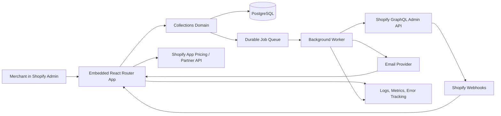

# B2B A/R Collections Assistant - Initial Project Plan

**Status:** Requirements approved; architecture package ready for review
**Date:** 2026-07-14
**Working name:** B2B A/R Collections Assistant

## 1. Product vision

Help small and growing Shopify wholesale merchants get invoices paid without
maintaining spreadsheets or manually deciding whom to chase each day.

The app turns Shopify payment-term orders into a reliable collections workflow:
see what is due, prioritize action, send appropriate reminders, record
commitments, and avoid extending more credit blindly.

## 2. Initial customer

The recommended first customer is a Shopify merchant that:

- has 10-300 wholesale customers on payment terms;
- processes roughly $20,000-$1 million in monthly wholesale revenue;
- manages receivables in Shopify plus spreadsheets or email;
- has an owner, finance administrator, or operations manager handling
  collections;
- does not want a full ERP or enterprise accounts-receivable platform.

Recommended pilot verticals are beauty, apparel, gifts, specialty food, office
supplies, and light manufacturing. We should select one or two for the first
pilot rather than market to every B2B merchant at once.

## 3. MVP outcome

A merchant installs the app, completes an initial sync, immediately sees an
accurate aging view, enables a safe reminder policy, and uses a daily queue to
collect overdue balances.

### MVP capabilities

1. Shopify installation, authentication, scopes, and tenant setup.
2. Initial import and ongoing synchronization of companies, company locations,
   payment-term orders, balances, and payment state.
3. Aging dashboard: current, 1-30, 31-60, 61-90, and 90+ days overdue.
4. Daily collections queue ordered by urgency and value.
5. Pre-due and overdue reminder policies with preview and approval controls.
6. Branded email reminders and account statements.
7. Promise-to-pay dates, internal notes, and activity timeline.
8. Customer payment reliability summary.
9. Warning when a customer with overdue debt places or receives another order.
10. CSV export and a weekly collections summary.
11. Shopify App Pricing plans and entitlement checks.
12. Privacy requests, uninstall handling, audit logs, monitoring, and support
    diagnostics.

### Explicitly outside the MVP

- Moving money, payment processing, financing, factoring, or lending
- Legal debt collection or credit-bureau reporting
- Full bookkeeping, general ledger, or bank reconciliation
- QuickBooks, Xero, ERP, or CRM integrations
- AI-written negotiation or autonomous changes to customer terms
- Team permissions beyond a simple owner/staff model
- Native mobile app, browser extension, or standalone customer portal
- Multi-currency accounting beyond displaying Shopify's authoritative amounts

## 4. Success measures

### Product quality

- First useful aging dashboard within five minutes for a typical pilot store
- No duplicate reminder for the same policy stage and receivable
- Reconciliation detects and repairs missed Shopify events
- Merchant-visible data clearly identifies last successful synchronization
- Reminder and sync failures are visible and recoverable

### Market validation after public launch

- 100 qualified installs within 90 days
- At least 20 paying merchants and $750-$1,000 MRR
- At least 50% of paying merchants retained after 60 days
- At least 30% of installs attributable to Shopify App Store discovery
- Support load below one hour per paying merchant per month

These are decision thresholds, not revenue forecasts.

## 5. Recommended system design

### Architecture style

Start with a modular monolith plus a separately runnable background worker. Use
ports and adapters around Shopify, email, billing, and job execution. This keeps
deployment and local development simple while protecting the collections
domain from provider-specific code.

Do not start with microservices. Split a service only after a measured scaling,
reliability, or team-ownership requirement appears.

### Proposed technology baseline

- Official Shopify React Router TypeScript template
- Embedded App Home UI using App Bridge and Polaris web components
- GraphQL Admin API only
- Node.js application and worker processes from the same codebase
- PostgreSQL as the transactional database
- Prisma initially, unless required Shopify B2B types expose a concrete blocker
- PostgreSQL-backed durable jobs initially; avoid a separate Redis dependency
  until throughput requires it
- Managed email provider with delivery webhooks, suppression handling, and
  merchant reply-to support
- Shopify App Pricing for free, monthly, and annual plans
- Structured logs, error tracking, metrics, and correlation IDs from day one

The architecture package selects Render as the reference pilot deployment,
Postmark for transactional email, and `pg-boss` for PostgreSQL-backed jobs.
Provider boundaries remain explicit so none of these choices becomes a domain
dependency.

### System context

### Module boundaries

- `platform/shopify`: authentication, tokens, GraphQL client, scopes, webhooks,
  API version, throttling, and reconciliation
- `tenancy`: shops, installation lifecycle, entitlements, and tenant isolation
- `receivables`: authoritative receivable projection and aging calculations
- `collections`: queue prioritization, notes, promises to pay, and customer
  reliability
- `reminders`: policies, scheduling, templates, idempotent delivery, and
  suppression
- `statements`: statement generation and export
- `billing`: plans, subscription state, and feature limits
- `privacy`: data requests, redaction, retention, and uninstall cleanup
- `operations`: audit events, job diagnostics, metrics, and administrative
  support tools

### Data ownership

Shopify remains authoritative for companies, locations, orders, payment terms,
transactions, refunds, cancellations, currency, and outstanding balances. The
app stores a synchronized projection for fast queries and historical workflow.

The app is authoritative for reminder policies, reminder attempts, delivery
status, internal notes, promise-to-pay dates, collection priority, calculated
reliability indicators, app subscriptions, webhook receipts, and audit events.

### Initial domain records

- Shop and installation credentials
- Company and company location projection
- Receivable and receivable balance snapshot
- Payment event
- Reminder policy and policy stage
- Reminder delivery and suppression
- Promise to pay
- Internal note
- Collection queue item or computed queue projection
- Customer reliability snapshot
- Webhook receipt
- Reconciliation cursor
- Subscription entitlement
- Audit event

## 6. Critical workflows

### Install and initial sync

1. Shopify-managed installation authenticates the merchant.
2. The app stores an encrypted, expiring offline token and refresh metadata.
3. Required webhooks and privacy handlers are verified.
4. A background bulk sync imports the minimum required B2B and order data.
5. The merchant sees progress, partial results, errors, and last-sync time.
6. Reconciliation validates the projection before reminders can be enabled.

### Incremental synchronization

1. Verify webhook HMAC and persist the Shopify webhook ID.
2. Return success quickly after durable acceptance.
3. Process asynchronously and idempotently.
4. Resolve out-of-order events using source timestamps and current GraphQL
   state rather than trusting arrival order.
5. Run scheduled reconciliation so missed events do not permanently corrupt the
   aging view.

### Reminder delivery

1. A scheduler identifies a due policy stage in the merchant's timezone.
2. Eligibility is rechecked against current receivable and suppression state.
3. A unique idempotency key prevents duplicate sends.
4. The provider accepts the message and returns a delivery identifier.
5. Delivery, bounce, complaint, suppression, and reply-relevant status are
   recorded in the activity timeline.
6. Failures retry with bounded backoff and eventually require operator or
   merchant attention.

### Uninstall and privacy

1. Disable jobs and sends immediately on app uninstall.
2. Revoke active operational access and mark the tenant inactive.
3. Fulfill customer data access or redaction requests from auditable handlers.
4. Delete protected shop/customer data on Shopify's required schedule while
   retaining only legally permitted, non-personal operational records.

## 7. Reliability and security requirements

- Verify session tokens and webhook HMAC signatures.
- Use expiring offline tokens and secure refresh-token rotation.
- Encrypt credentials and sensitive fields at rest.
- Enforce shop ID on every tenant-owned query and unique constraint.
- Store the minimum customer data required for collections.
- Never log access tokens, full webhook payloads, or message bodies by default.
- Deduplicate webhook deliveries and reminder jobs.
- Handle GraphQL cost throttling with per-shop backoff and bounded concurrency.
- Reconcile source data periodically and expose manual repair tooling.
- Use database migrations with tested forward and rollback procedures.
- Define retention and deletion schedules before pilot data is collected.
- Create alerts for sync lag, queue age, webhook errors, reminder failure,
  token-refresh failure, and email bounce/complaint spikes.

## 8. Delivery roadmap

Exact dates should be set after the decision gates below are approved. A
focused six-week MVP is reasonable for one experienced builder, excluding
uncontrolled Shopify review time.

### Phase 0 - Product decisions and pilot setup

- Select one or two pilot verticals.
- Validate the daily collections workflow with at least five merchants or
  bookkeeping/wholesale operators.
- Obtain three serious pilot commitments.
- Approve scope, pricing hypothesis, and market success thresholds.

**Exit:** requirements inputs and pilot cohort are credible.

### Phase 1 - Requirements and PRD

- Write `docs/requirements.md` and `docs/prd.md`.
- Define personas, user journeys, stories, acceptance criteria, and non-goals.
- Specify aging and balance semantics for edge cases.

**Exit:** product scope and acceptance criteria are approved.

### Phase 2 - Architecture and risk

- Write `docs/architecture.md`, context/container diagrams, data model, API and
  event contracts, threat model, and operational story.
- Create ADRs for the data projection, job system, email identity, hosting, and
  protected-data strategy.
- Verify required Shopify scopes and API fields against a development store.

**Exit:** major decisions and risks are approved.

### Phase 3 - Platform foundation

- Scaffold the official Shopify React Router application.
- Configure PostgreSQL, CI, environments, secrets, auth, token rotation,
  webhooks, privacy handlers, logging, and error tracking.
- Prove install, uninstall, and one idempotent background job end to end.

**Exit:** a secure production-shaped vertical slice works in a development
store.

### Phase 4 - Receivables projection

- Implement initial bulk import, incremental sync, reconciliation, aging, and
  the first dashboard.
- Cover partial payments, refunds, edits, cancellations, timezones, and
  currencies defined in requirements.

**Exit:** seeded stores produce a trusted aging view and repair missed events.

### Phase 5 - Collections workflow

- Implement daily queue, customer detail, notes, promises to pay, reliability
  summary, statements, and CSV export.

**Exit:** a merchant can complete the core collections workflow without email
automation.

### Phase 6 - Reminder automation

- Implement policy builder, previews, scheduling, branded templates,
  idempotent sends, delivery events, suppression, retries, and audit history.

**Exit:** reminders are safe enough for controlled pilot use.

### Phase 7 - Billing, quality, and pilot

- Add Shopify App Pricing entitlements and plan limits.
- Complete security, accessibility, responsive UI, performance, load, recovery,
  and end-to-end testing.
- Add support diagnostics, runbooks, backup restore, and rollback.
- Run the paid pilot behind controlled access.

**Exit:** pilot success thresholds and critical-quality gates are met.

### Phase 8 - App Store launch

- Finalize listing, onboarding, privacy policy, terms, support materials, demo
  data, and review instructions.
- Submit for protected-data and App Store review as applicable.
- Roll out gradually and measure install, activation, conversion, retention,
  support load, and collection outcomes.

**Exit:** public production is stable and the 90-day market experiment is
running.

## 9. Approved product decisions

1. **Pilot niche:** Beauty wholesalers.
2. **Payment scope:** Shopify-recorded payment state is authoritative. The MVP
   permits non-authoritative external-payment notes but does not perform
   accounting reconciliation.
3. **Email identity:** Use an app-managed verified sending domain with the
   merchant as reply-to. Custom merchant sending domains are deferred.
4. **Automation safety:** The pilot requires preview and approval before a
   reminder policy becomes active, plus a global pause switch.
5. **Free plan:** Support up to five active payment-term customers with limited
   automation; paid plans unlock larger customer counts and workflows.
6. **Hosting:** Use Render as the pilot reference deployment, with a web
   service, background worker, and managed PostgreSQL in one selected region.
   Revisit only if pilot residency, scale, or cost evidence requires it.
7. **Launch sequence:** Run three to five paid pilot stores before Shopify App
   Store submission.

## 10. Immediate next action

Review and approve the package under `docs/architecture/`. Then decompose the
approved MVP into implementation tasks before scaffolding application code.
